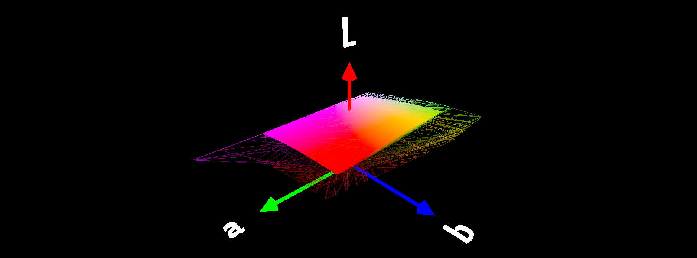

# GamutViz

Visualizing color gamuts. The following is some information we used:

- https://sourceforge.net/projects/sampleicc/
- https://sourceforge.net/projects/lcms/
- https://github.com/mm2/Little-CMS
- https://github.com/sk1project/python-lcms2
- https://sourceforge.net/projects/iccxml/
- https://www.color.org/iccmax/profiles/srgb-iccmax.xalter
- https://github.com/InternationalColorConsortium/DemoIccMAX

Convert ICC profiles from C:\Windows\System32\spool\drivers\color into XML format and use the lookup table to generate a mesh
CLUT>TableData

- [profiles/sRGB_D65_MAT.xml](https://www.color.org/iccmax/profiles/sRGB_D65_MAT.xml)
- [profiles/sRGB_D65_colorimetric.xml](https://www.color.org/iccmax/profiles/sRGB_D65_colorimetric.xml)